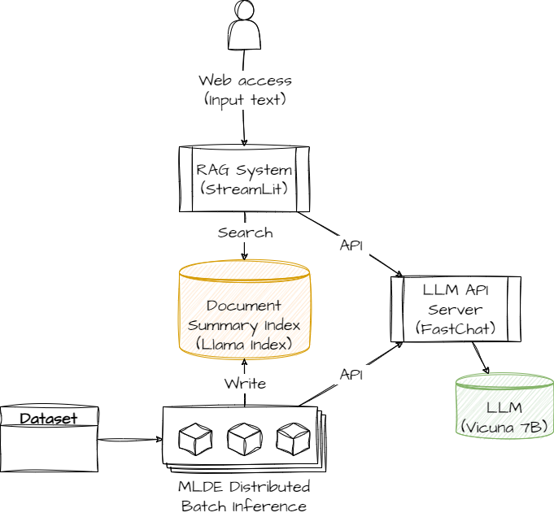
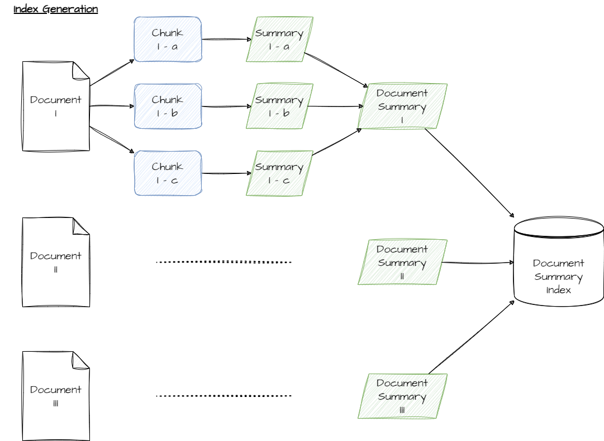
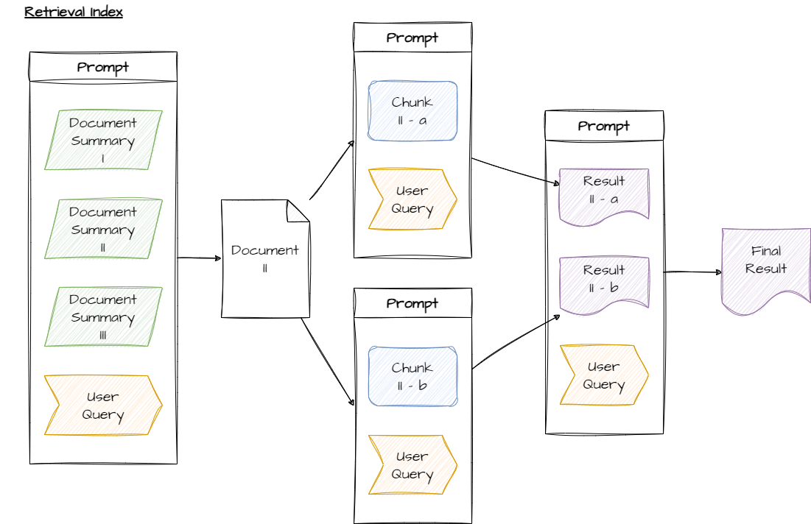
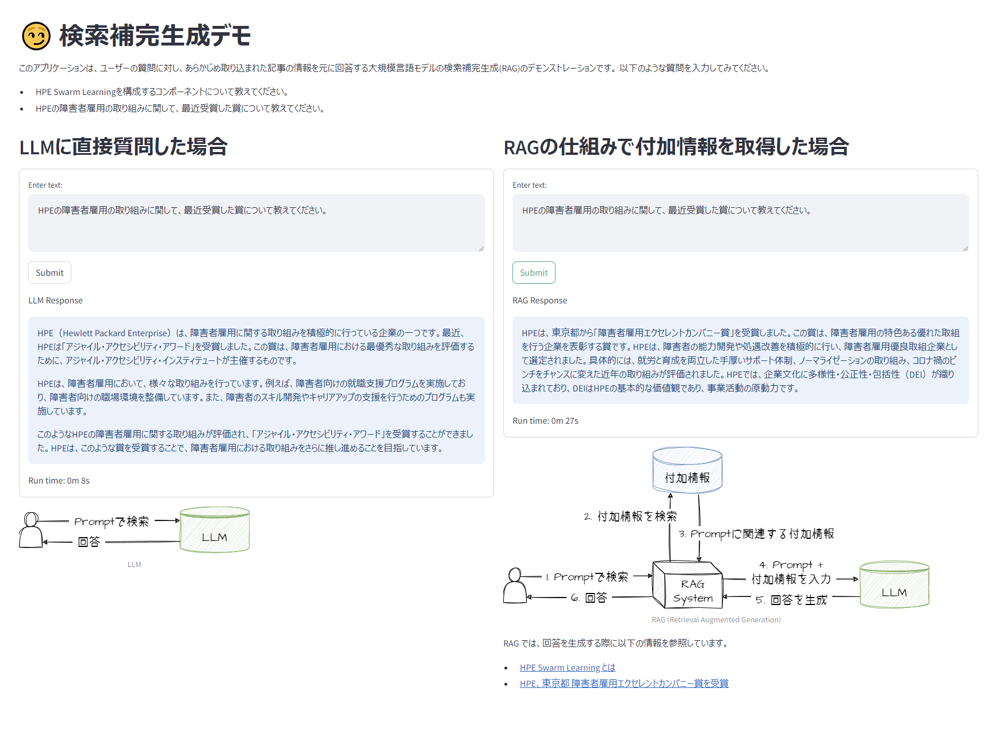

# LLM-RAG-with-MLDE

LLM RAG System with MLDE


## Architecture



### Index Generation



### Retrieval Index




## Showcase




## Prerequisite

``` bash
docker create network rag-system
```


## How to Run

### Build container images

``` bash
make build
```

### Start LLM

``` bash
make up-fastchat-controller
make up-fastchat-model-worker
make up-fastchat-api-server
```

### Start determined cluster

``` bash
make up-determined
```

### Create Embedding DB

``` bash
make run-inference
```

### Start RAG System

``` bash
make up-rag
```
